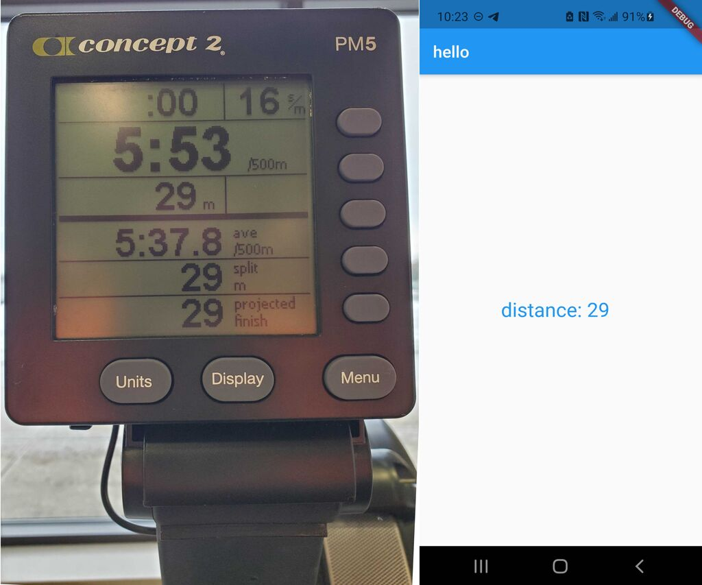

# c2bluetooth

[](https://github.com/CrewLAB/c2bluetooth/actions/workflows/dart.yml)

C2Bluetooth is a flutter package designed to provide an easy API for accessing data from Concept2 PM5 Indoor fitness machines via bluetooth. This library implements the [Concept2 Performance Monitor Bluetooth Smart Communications Interface Definition](https://www.concept2.com/files/pdf/us/monitors/PM5_BluetoothSmartInterfaceDefinition.pdf) Specification ([newer versions](https://www.c2forum.com/viewtopic.php?f=15&t=193697#p527068) are also available). It also relies heavily on the [CSAFE specification](https://web.archive.org/web/20060718175014/http://www.fitlinxx.com/csafe/specification.htm) from FitLinxx.

## Demo



This is a relatively old screenshot of the included example app using an older version of the library to display the completed distance from a short 20-second test workout. Many improvements to expose more datapoints have been made since this screenshot was taken.
## Key Features

Currently this library supports a few basic features such as:
- retrieving workout summary information from the erg after a workout
- programming a workout into the erg

In the future, we hope to add support for things like:
- Streaming data during a workout
- updating the time on the erg
- updating the erg firmware


## Installation

To install this package, just like any other flutter package, it needs to be included in your pubspec.yaml. Here are some templates for doing so:

**Pub.dev version**
To install from pub.dev, run the command `flutter pub add c2bluetooth` or add the following to your dependencies in pubspec.yaml:
```
dependencies:
  c2bluetooth: ^1.0.0
```

Alternative installation methods for development can be found in [CONTRUBUTING.md](CONTRIBUTING.md)

## Usage
Similar to how the underlying bluetooth library works, pretty much everything begins with an instance of `ErgBleManager()`. For a complete example, see the [example app](example/)'s main.dart file. Below are some of the key steps

### Creating a manager

```dart
ErgBleManager bleManager = ErgBleManager();
bleManager.init(); //ready to go!
```
### Scanning for devices
Next, you need to start scanning for available devices. This uses a Stream that returns instances of the `Ergometer` class. Each of these instances represents an erg and can be saved for later reuse.

**Important:** This library does not handle things like permissions and many of the later steps, this one included, will fail if bluetooth is off or if permissions are not correct. It is the responsibility of users of this API to ensure permissions are correct before beginning a bluetooth scan.

```dart
bleManager.startErgScan().listen((erg) {
	//your code for detecting an erg here.
});
```
This block of code is where you can do things like:
 - determine what erg(s) you want to work with (this can be based on name, user choice, or basicaly anything)
 - store the erg instance somewhere more permanent, like a variable in a scope thats outside of this function (this allows you to access it after you stop scanning)
 - call `bleManager.stopErgScan()` if you are done. For example, one way to immediately connect to the first erg found is to unconditionally call `stopErgScan` within this function. Don't forget to close the stream too!


### Connecting to an erg
Once you have the `Ergometer` instance for the erg you want to connect to, you can call `connectAndDiscover()` on it to connect.

```dart
await myErg.connectAndDiscover();
```

### Getting workout summaries
To get data from the erg, use one of the methods available in the `Ergometer` class. Currently this is only `monitorForWorkoutSummary()`. This is a stream that returns a `WorkoutSummary` object that allows you to access the data from a completed workout (this includes programmed pieces as well as "Just row" pieces that are longer than 1 minute)

```dart
myErg.monitorForWorkoutSummary().listen((workoutSummary) {
  //do whatever here
});
```

### Disconnecting
When you are done, make sure to disconnect from your erg:
```dart
await myErg.disconnectOrCancel();
```


## Community Projects
This is a list of projects built using c2Bluetooth. If you find or make something that is not on this list, send us a pull request!

- [CrewLAB app](https://www.crewlab.io/) (proprietary license)
- 
## Support and Licensing


This library is supported by [CrewLAB](https://www.crewlab.io/). If you would like to license this library for use in a proprietary app, please reach out via our [support page](https://www.crewlab.io/support).

