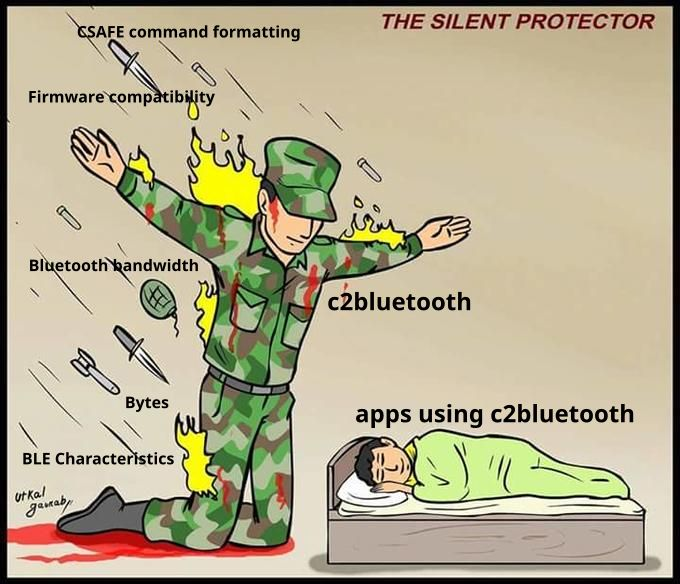

# API

This document is the starting point for learning more about the c2bluetooth API and inner workings at varying levels of detail:

- The broadest overview comes from using the API as documented in the README
- sections like [Core Values](#core-values) help explain more of the "why" behind some of the design choices made in the API.
- The [Basic api details](#basic-api-details) section is a detailed, mid-level overview of as man aspects of the public API as posible and what their purpose is.
- For people looking to get into the internals of c2bluetooth or make contributions, see the [internals](internals.md) document.
- Obviously the most detailed explaination of how the code works comes from reading the code and inline comments themselves. It is helpful to understand the general goals first 

## Terms used

"implementor" generally refers to users of this library. This is intended to be an audience of primarily other flutter developers looking to use this library in their apps.

## Core values

These are some of the core values that were considered as part of the development of this library and forms the ethos/soul of the project. These should be used as general guidance when questions of scope or direction of the library are considered. 

### The Silent Protector

This principle shares its name with the [popular meme template](https://knowyourmeme.com/memes/the-silent-protector) depicting a soldier kneeling over and protecting a sleeping child.

This is essentially a graphical analogy to represent the idea that this library aims to "take on" as much responsibility for abstracting low-level details and hiding away various "gotchas" and complexities of the Concept2 Bluetooth interface specification as possible.

To my knowledge this is not currently a software design principle found in the broader software industry. However I think it is an awesome way to explain the concept.

### Inspiration
In order for this library to be a good fit within the community and provide a good user experience for developers, the goal is to design the interface for this library after other existing libraries interfacing with Concept2 rowing machines. The libraries looked at were [Py3Row](https://github.com/droogmic/Py3Row) (Python, BSD-2), [BoutFitness/Concept2-SDK](https://github.com/BoutFitness/Concept2-SDK) (Swift, MIT), [ErgometerJS](https://github.com/tijmenvangulik/ErgometerJS) (Javascript, Apache 2).

There are likely more libraries like these available, but these were just the first few that were looked at based on a GitHub search at the time of writing.

### Object Oriented
These three examples all seem to use some kind of object-oriented approach where a particular instance of an object represents a particular rowing machine and contains functions to make interaction with the machine easier, like getting data. 

Designing the library in an object oriented way seemed to make the most sense given what other projects in the space seem to have done. This should also should keep things relatively straightforward to program and maintain.

### Subscription-based data access
Both BoutFitness/Concept2-SDK and ErgometerJS also seemed to have a way to asynchronously "subscribe" to get a callback when particular values change so values being displayed on the screen in the implementors flutter app can be updated. Since many Flutter bluetooth libraries also expose notification data from bluetooth devices as [Flutter streams](https://apgapg.medium.com/using-streams-in-flutter-62fed41662e4), this seems like a good, clean way to expose data about a PM5.

#### Single Values
For getting single values from an erg, such as serial number, software and hardware version info, and other things that likely wont change that often, Streams may be unnecessary and it might be easier to have a simple synchronous interface for grabbing a value either from the erg or from somewhere in the memory allocated to the particular Erg object being used.

<!-- ### Modularity
Since a lot of the architecture is already provided by FlutterBleLib and will likely just pass through most of the aspects of the existing bluetooth APIs, it seems like it may be useful to make this passthrough more explicit. By duplicating any of the types and methods exposed by FlutterBleLib this package will be be more able to maintain a stable API, even in the event that there is a technical need (or desire from users) to be able to change the underlying bluetooth implementation, potentially even grouping the methods that handle the actual bluetooth access into a class/interface. This is something whtat would be helpful to keep in mind during initial development but shouldn't take too much energy until later versions. -->

## Basic API details

This library is built from a few core concepts, some of which are shared with the `csafe-fitness` library. These core concepts represent general groupings of classes that serve a particular purpose or abstract certain aspects of communicating with an erg.

These concepts are roughly divided up into "external" (i.e. those that are part of the libraries public API) and "internal". If you are just using the library in your app, the external concepts should be all you need. Anyone looking to contribute to this library might find the "internal" concepts helpful 

### External Concepts

#### Model Objects
This is a gairly general group of classes that represent various indoor rowing concepts (in the form of objects). Some examples of classses in this category are the `Ergometer` and `Workout` classes. Unlike Data Objects, they are intended to be able to enable bidirectional data flow. For example, an `Ergometer` object may have properties for getting data (such as Data Objects) but also may contain methods like `sendWorkout()` that allow you to provide a `Workout` object to set up on the erg. `Workout` objects could also be returned by other methods as a way to represent a workout.  

Model objects are located in the `models` directory.